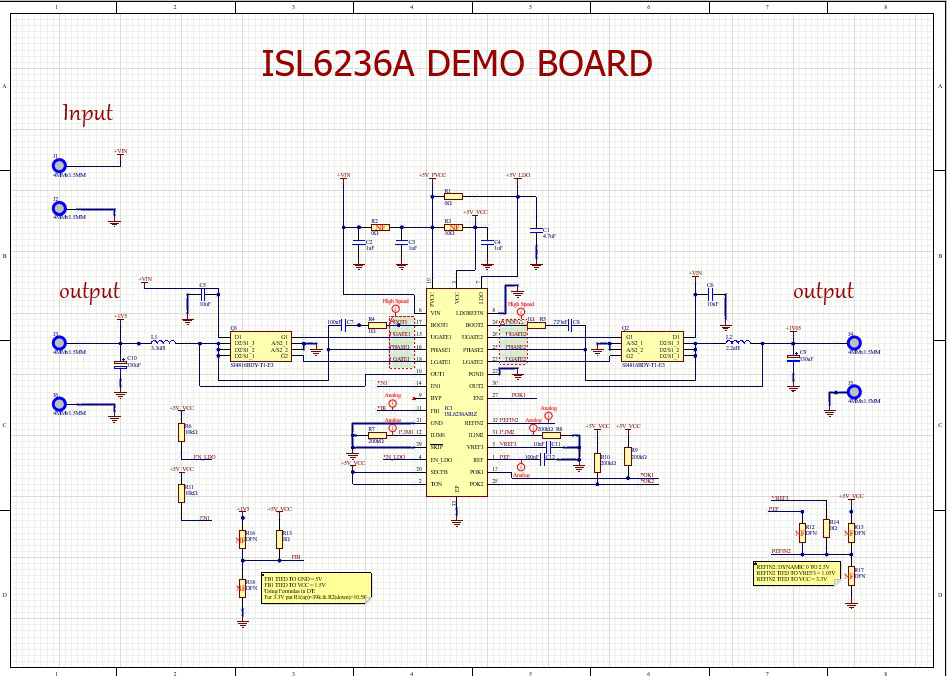
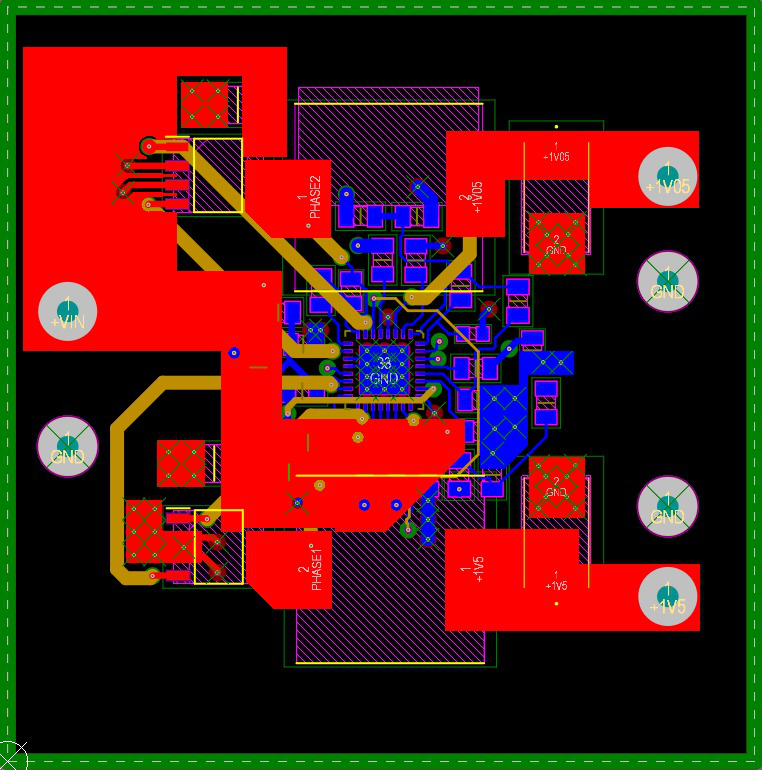
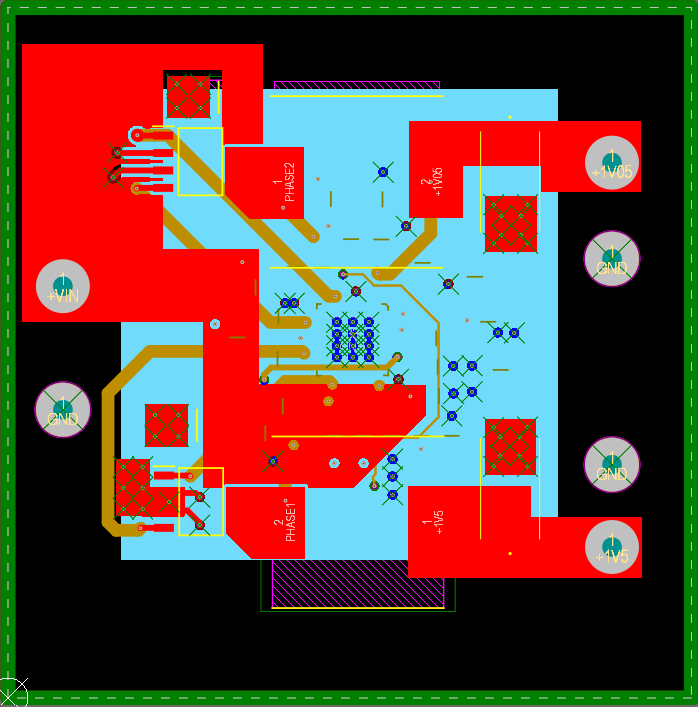
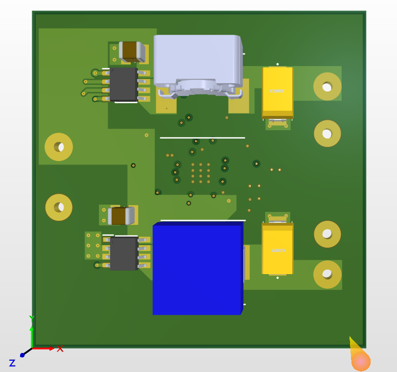
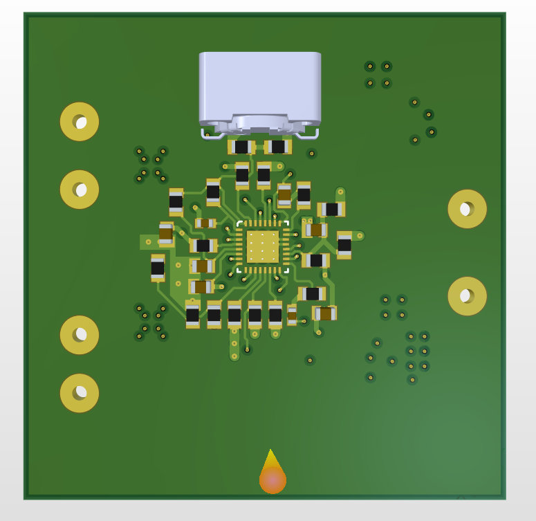

# ISL6236-Based SMPS Design

This repository contains the design files and documentation for a **Switching Mode Power Supply (SMPS)** built using the **ISL6236** IC. The design is optimized for high efficiency, stability, and real-world applications, such as laptop motherboards.

---

## Table of Contents

1. [Overview](#overview)
2. [Why ISL6236?](#why-isl6236)
3. [Design Features](#design-features)
4. [PCB Stackup](#pcb-stackup)
5. [Images](#images)
6. [Files Included](#files-included)
7. [Applications](#applications)
8. [License](#license)

---

## Overview

The **ISL6236** is a dual-channel synchronous buck controller designed for high-efficiency power management in battery-powered systems. This design leverages its capabilities to deliver two regulated outputs from a wide input voltage range (5V to 25V). The outputs are stable, efficient, and suitable for powering critical components like CPUs, GPUs, and memory modules in laptops and notebooks.

---

## Why ISL6236?

The **ISL6236** was chosen for this design due to the following reasons:
- **Wide Input Voltage Range**: Supports inputs from **5V to 25V**, making it versatile for various power sources.
- **Dual Output Channels**: Provides two independent outputs, which can be configured for different voltage levels (e.g., 5V, 3.3V, 1.5V, etc.).
- **Stability**: Ensures clean and stable power delivery, even under varying load conditions.
- **Real-World Applications**: Similar designs are widely used in **laptop motherboards**, ensuring reliability and compatibility with modern electronics.

---

## Design Features

- **Input Voltage**: 5V to 25V
- **Outputs**:
  - **Output 1**: Configurable (e.g., 5V, 3.3V)
  - **Output 2**: Configurable (e.g., 1.5V, 1.05V)
- **Efficiency**: Optimized for high efficiency using synchronous rectification.
- **Thermal Management**: Designed with thermal vias and proper grounding to manage heat dissipation.
- **EMI Mitigation**: Ground planes on Layers 2 and 5 act as shields to reduce electromagnetic interference.

---

## PCB Stackup

The PCB is designed with a **6-layer stackup** to ensure optimal performance, signal integrity, and EMI shielding. The layers are organized as follows:

| Layer | Description                                                                 |
|-------|-----------------------------------------------------------------------------|
| L1    | **Power and Output Signals**: Wide traces and copper pours for high currents. |
| L2    | **Ground Plane**: Acts as a shield to minimize EMI.                          |
| L3    | **Signal Layer**: High-speed and critical signals routed here.                |
| L4    | **Power Planes**: Additional power distribution for stability.               |
| L5    | **Ground Plane**: Second ground plane for enhanced EMI shielding.           |
| L6    | **Signal Layer**: Non-critical signals and auxiliary paths.                 |

---

## Images

### Schematic

### Layout
- **Traces (Planes Hidden)**  
  
- **With Planes Visible**  
  

### 3D Views
- **Front View**  
  
- **Back View**  
  

---

## Files Included

- **Schematic File**: `ISL6236_Schematic.sch`
- **Layout File**: `ISL6236_Layout.brd`
- **Gerber Files**: `ISL6236_Gerber_Files.zip` (for manufacturing)
- **Datasheet**: `Datasheet_ISL6236.pdf` (for reference)
- **Additional Notes**: `Notes.txt` (optional)

---

## Applications

This SMPS design is suitable for:
- **Laptop Motherboards**: Powers CPUs, GPUs, and other critical components.
- **Battery-Powered Systems**: Ideal for portable devices requiring efficient power management.
- **Industrial Electronics**: Provides stable voltages for sensitive components.

---

## License

This project is licensed under the **MIT License**. Feel free to use, modify, and distribute the design files as needed.

---

## Acknowledgments

- Special thanks to **Intersil** for providing the ISL6236 datasheet and application notes.
- Contributions and feedback are welcome! If you have any questions or suggestions, feel free to open an issue or contact me.

---

## Contact

For inquiries or collaboration opportunities, reach out via:
- Email: [your-email@example.com](mailto:your-email@example.com)
- LinkedIn: [Your LinkedIn Profile](https://www.linkedin.com/in/your-profile)
